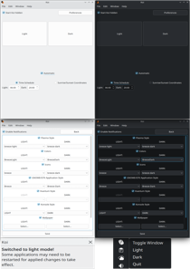

<p align="center"></p>

<h1 align="center">Koi</h1> 

<h3 align="center">Scheduling LIGHT/DARK Theme Converter for the KDE Plasma Desktop</h3>

Koi is a program designed to provide the KDE Plasma Desktop functionality to automatically switch between light and dark themes. Koi is under semi-active development, and while it is stable enough to use daily, expect bugs. Koi is designed to be used with Plasma, and while some features may function under different desktop environments, they are untested and unlikely to work . . .

___

## Features

- Toggle between **Light** and **Dark** preset themes based on **time** / **coordinated** schedule
- Change **Plasma style**
- Change **QT Colour scheme**
- Change **Icon theme**
- Change **GTK/GNOME theme**
- Change **KDE Konsole (Light/Dark) profiles**
- Change **Light/Dark wallpapers**
- **Hide application** to system tray *(it is currently unable to hide Koi from system tray)*
- **Enable/Disable notifications** about Light/Dark theme switching
- Toggle between LIGHT/DARK themes by clicking **middle mouse button** *(wheel)*
- Full **DBus** service integration*; when setup correctly, enables possibility using Koi and theme switching using custom commands & keyboard shortcuts*
- Run custom **BASH scripts** when switching between Light/Dark themes

___

## Screenshots



___

## Using Koi

Koi is designed to be very simple to use. After the initial run of Koi, settings for the **light** and **dark** presets will be empty, all you need to do is select which themes you would like for Koi to manage and select your desired themes by clicking the *Preferences* button.

If you would like that Koi switch between your light and dark settings automatically, you can select this option in the main page of the program, and choose between following a user set schedule, or at **sunrise** and **sunset** *(planned/scheduled feature)*. To switch between **light** and **dark** manually right click the tray icon and select the desired preset, or do so from Koi's main window.

After installation, Koi creates `~/.config/koirc` file inside user's Home configuration directory with established theme presets . . .

#### Startup/Autostart
In order to have Koi started at login, you can do so with the *KDE Plasma System Settings*.

Search for: ***Autostart***

**Plasma** version **5** navigate to ***System Settings*** -> ***Startup and Shutdown*** -> ***Autostart***; and select "`+ Add...` -> `+ Add Application` -> `Utilities` -> `Koi`"


**Plasma** version **6** navigate to ***System Settings*** -> ***System*** -> ***Autostart***, and select "`+ Add...` -> `+ Add Application` -> `Utilities` -> `Koi`"

In addition, it is recommended having the option to *Start Koi hidden* checked, this will prevent Koi from popping up every time you start your operating system.

___

## Getting Koi

*Latest version: [0.6](https://github.com/baduhai/Koi/releases/tag/0.6)*

### Building from SOURCE

### Prerequisites:

<details>
  <summary>Click to expand for GENERIC Dependencies:</summary>

**GENERIC Dependencies:**

<ins>**[KDE Plasma Desktop Environment](https://kde.org/plasma-desktop/)**</ins>

<ins>**[KDE Frameworks](https://develop.kde.org/products/frameworks/) [Development files]:**</ins>   
 * KF 6 Config
 * KF 6 Core Addons
 * KF 6 Widgets Addons

<ins>**[QT](https://qt-project.org/) [Development files]:**</ins>   
 * QT 6 Core
 * QT 6 DBus
 * QT 6 Gui
 * QT 6 Widgets
 * QT 6 Xml

<ins>**[CMake Program](https://cmake.org/)**</ins>
</details>


<details>
  <summary>Click to expand for Arch Linux Dependencies:</summary>

#### Arch Linux - [[AUR]](https://aur.archlinux.org/packages/koi/)

*Build Dependencies:*

```
'gcc' 'qt6-base' 'qt6-tools' 'qt6-svg' 'cmake' 'extra-cmake-modules'
```

*Run Dependencies:*

```
'plasma-desktop' 'plasma-integration'
```
</details>

<details>
  <summary>Click to expand for SUSE Leap 16 / TumbleWeed / SlowRoll Dependencies:</summary>

#### SUSE Leap 16 / TumbleWeed / SlowRoll - [[OBS]](https://build.opensuse.org/package/show/KDE:Extra/koi)

*Build Dependencies:*

```
'cmake' 'cmake-extras' 'kf6-kconfigwidgets-devel' 'kf6-kconfig-devel' 'kf6-kcoreaddons-devel' 'kf6-kdbusaddons-devel' 'qt6-base'  'qt6-dbus-devel' 'qt6-gui-devel' 'qt6-widgets-devel' 'qt6-xml-devel' 'hicolor-icon-theme'
```

*Run Dependencies:*

```
'plasma6-desktop' 'plasma6-workspace'
```
</details>

<details>
  <summary>Click to expand for SUSE Leap 15.6 Dependencies:</summary>

#### SUSE Leap <= 15.6 - [[OBS]](https://build.opensuse.org/package/show/KDE:Extra/koi)

*Build Dependencies:*

```
'cmake' 'cmake-extras' 'kf5-kconfigwidgets-devel' 'kf5-kconfig-devel' 'kf5-kcoreaddons-devel' 'kf5-kdbusaddons-devel' 'qt5-dbus-devel' 'qt5-gui-devel' 'qt5-widgets-devel' 'qt5-xml-devel' 'hicolor-icon-theme'
```

*Run Dependencies:*

```
'plasma5-desktop' 'plasma5-workspace' 'plasma-framework'
```
</details>

<details>
  <summary>Click to expand for Fedora 40+ Dependencies:</summary>

#### Fedora >= 40 - [[COPR]](https://copr.fedorainfracloud.org/coprs/birkch/Koi/)

*Build Dependencies:*

```
'cmake' 'extra-cmake-modules' 'kf6-kconfigwidgets-devel'  'kf6-kconfig-devel' 'kf6-kcoreaddons-devel' 'kf6-kwidgetsaddons-devel' 'qt6-qtbase-devel' 'hicolor-icon-theme'
```

*Run Dependencies:*

```
'plasma-desktop' 'plasma-integration' 'plasma-workspace'
```
</details>

<details>
  <summary>Click to expand for Debian 12- / Ubuntu 24.04- Dependencies:</summary>

#### Debian <= 12 / Ubuntu <= 24.04 - [OBS](https://software.opensuse.org//download.html?project=home%3AMartinVonReichenberg%3AKDE%3AExtra&package=koi)

*Build Dependencies:*

```
'g++' 'cmake' 'cmake-extras' 'extra-cmake-modules' 'libkf5config-dev' 'libkf5coreaddons-dev' 'libkf5dbusaddons-dev' 'libkf5widgetsaddons-dev' 'qtbase5-dev'
```

*Run Dependencies:*

```
'plasma-desktop' 'plasma-framework' 'plasma-integration' 'plasma-workspace'
```
</details>

<details>
  <summary>Click to expand for Debian 13+ / KDE Neon / Ubuntu 24.10+ Dependencies:</summary>

#### Debian >= 13 / KDE Neon / Ubuntu >= 24.10 - [OBS](https://software.opensuse.org//download.html?project=home%3AMartinVonReichenberg%3AKDE%3AExtra&package=koi)

*Build Dependencies:*

```
'g++' 'cmake' 'cmake-extras' 'extra-cmake-modules' 'libkf6config-dev' 'libkf6coreaddons-dev' 'libkf6dbusaddons-dev' 'libkf6widgetsaddons-dev' 'qt6-base-dev'
```

*Run Dependencies:*

```
'plasma-desktop' 'plasma-integration' 'plasma-workspace'
```
</details>

<details>
  <summary>Click to expand for Void Linux Dependencies:</summary>

#### Void Linux - [SRCPKGS (GitHub)](https://github.com/void-linux/void-packages/tree/master/srcpkgs/koi)

*Build Dependencies:*


```
'gcc' 'cmake' 'extra-cmake-modules' 'qt6-base-devel' 'kf6-kcoreaddons-devel' 'kf6-kconfig-devel' 'kf6-kwidgetsaddons-devel' 
```

*Run Dependencies:*

```
'kf6-kcoreaddons' 'kf6-kconfig' 'kf6-kconfigwidgets' 'kf6-kdbusaddons' 'plasma-desktop' 'plasma-integration' 'plasma-workspace' 'qt6-base' 'qt6-core'
```
</details>

<details>
  <summary>Click to expand for NixOS Instructions:</summary>

#### *NixOS - [[NixPKGs (GitHub)]](https://github.com/NixOS/nixpkgs/blob/master/pkgs/kde/third-party/koi/default.nix)*

- Install Directly from NixPKGs to your NIX Profile with: `nix-env -iA nixpkgs.koi` ;

- Using NixOS Configuration (`configuration.nix`):      
`environment.systemPackages = with pkgs; [koi];`

- Or Compile Manually Using `nix-build https://github.com/NixOS/nixpkgs/blob/master/pkgs/kde/third-party/koi/default.nix`
</details>

<details>
  <summary>Click to expand for Guix GNU/Linux Instructions:</summary>

#### *Guix - [[Guix Packages]](https://packages.guix.gnu.org/packages/koi)*

- Install Directly from Guix Package Database with: `guix install koi` or `guix install koi@0.6`

- You might need / want to use customized environmental variables when BUILDing from SOURCE:
  _They should already be a part of the `CMakeLists.txt` file - Check it out . . ._
```
  src/plugins/colorscheme.cpp                                               
    QDir colorsNixDir("/var/run/current-system/sw/share/color-schemes");       
  src/plugins/kvantumstyle.cpp                                              
    QDir kvantumStyleNixDir("/var/run/current-system/sw/Kvantum");             
  src/plugins/icons.cpp                                                     
    QDir iconsNixDir("/var/run/current-system/sw/share/icons");                
  src/plugins/plasmastyle.cpp                                               
    QDir stylesNixDir("/var/run/current-system/sw/share/plasma/desktoptheme"); 
  src/plugins/gtk.cpp                                                       
    QDir gtkNixDir("/var/run/current-system/sw/share/themes");                 
```
</details>


### Build & Install Instructions:

<details>
  <summary>Click to expand for "All-In-One" Build Instructions:</summary>
  
*Copy all:*

```
# 1.  CLONE Koi Repository
# a) 
  git clone "https://github.com/baduhai/Koi.git"  # Using [git] Command
# b)
# gh repo clone "baduhai/Koi"                     # Using [gh]  Command

# 2.  CHANGE to Koi Directory
  cd ./Koi/

# 3.  MAKE from SOURCE to BUILD Directory
  cmake -S "." -B "./build/"

# 4.  BUILD Koi BINARY from SOURCE
  cmake --build "./build/" --parallel  # Remove [--parallel] Option on Weaker Hardware

# 5.  INSTALL Koi into the SYSTEM
# a)
  sudo cmake --install "./build/"  # This Will, by Default, Install Koi into [/usr/local/bin/] Directory
# b)
# sudo cmake --install "./build/" --prefix="/usr/"  # This Will Install Koi into [/usr/bin/] Directory

# (6.) 
# sudo make uninstall -C "./build/"
```
</details>

___

## Credits

* William Franco Abdul Hai [(baduhai)](https://github.com/baduhai)
* Martin Stibor    [(Martin von Reichenberg)](https://github.com/MartinVonReichenberg)
* Matthias Möller  [(TinyTinni)](https://github.com/TinyTinni)
* Spencer Williams [(spencerwi)](https://github.com/spencerwi)
* Andrea Spelgatti [(Ourouk)](https://github.com/Ourouk)
* Giovanni Santini [(Itachi San)](https://github.com/ItachiSan)
* [milahu](https://github.com/milahu)
* [DucVietCao](https://github.com/ducvietcao)
* [PassportMidi](https://github.com/passportmidi)
* [FinanceLurker](https://github.com/financelurker)
* [miaouwu](https://github.com/miaouwu)
* [Grimpper](https://github.com/Grimpper)
* [Ari Melody](https://github.com/arimelody)
* [ToBoil-Features](https://github.com/toboil-features)


## References

The following is a list of resources that was used as reference and inspiration for writing Koi.

- [Yin-Yang](https://github.com/daehruoydeef/Yin-Yang) - For UI layout and features inspiration.
- [system-tray-icon-qt](https://github.com/C0D1UM/system-tray-icon-qt) - For teaching me how to implement a system tray icon with Qt.
- [plasma-theme-switcher](https://github.com/maldoinc/plasma-theme-switcher) - For teaching me how to set current Qt color scheme.
- [ksetwallpaper](https://github.com/pashazz/ksetwallpaper) - For teaching me how to set the wallpaper on Plasma.
- [SunRise](https://github.com/signetica/SunRise) - For scheduled sunrise/sunset light/dark theme switching.
- [CTPL](https://github.com/vit-vit/CTPL) - Extra library for parallel job execution.
- [Scheduler](https://github.com/Bosma/Scheduler) - For timed light/dark theme switching.
- [This blog post from Zren](https://zren.github.io/2020/04/28/how-to-change-plasma-icon-theme-in-the-terminal) - For teaching me how to set the icon theme.


*Koi was written as a project to practice QT by a novice programmer, expect code to be written sloppily.*
